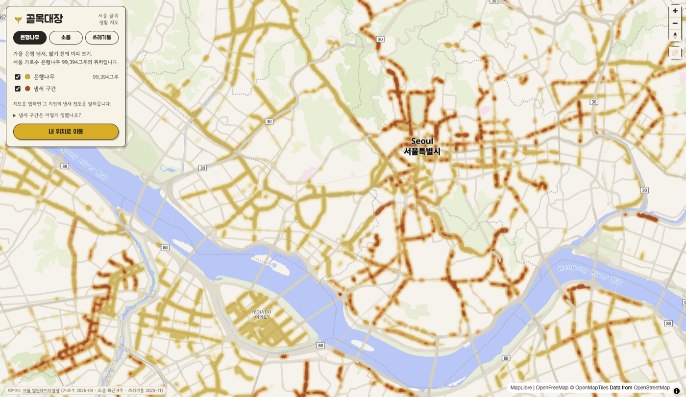
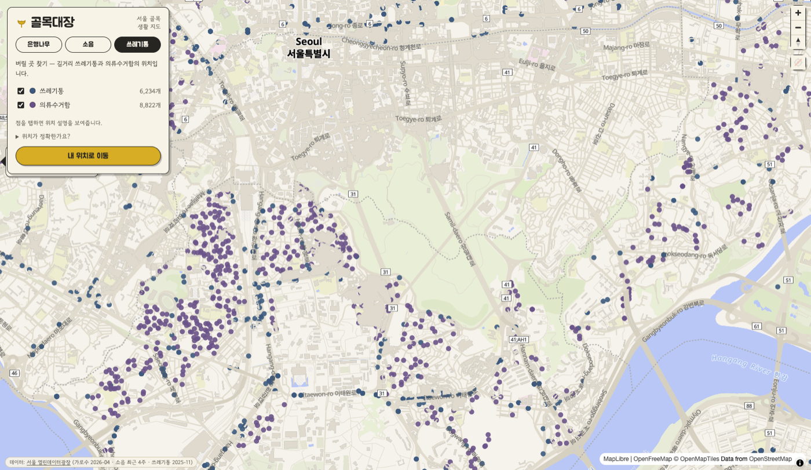

<div align="center">


# 골목대장

**서울 골목 사정을 다 꿰고 있는 지도**

가을 은행 냄새 🍂 골목 소음 🔉 쓰레기통·의류수거함 🗑️

[**👉 지도 열어보기**](https://grboy6770.github.io/golmok-daejang/)

[](https://github.com/grboy6770/golmok-daejang/actions/workflows/update-noise.yml)

-2b2926)


</div>

---

골목대장은 동네를 꽉 잡고 있는 그 아이 이름이면서, 골목 데이터를 적어두는 대장(臺帳)이기도 합니다.
서울시가 공개한 데이터를 지도 한 장에 켜켜이 쌓는 개인 프로젝트예요. 누군가 쓸지도 몰라서 만들었습니다.

## 뭘 볼 수 있나요

### 🌳 은행나무 편 — "밟기 전에 미리 보기"

가을마다 길에서 그 냄새가 나는 이유: 서울 가로수 28만여 그루 중 **9만 9천여 그루가 은행나무**이고,
열매(와 냄새)는 그중 암나무에서만 나옵니다. 서울시 데이터에 암나무로 기록된 1만 5천여 그루 주변을
**냄새 구간**으로 칠했습니다.

- 지도를 탭하면 그 지점 기준 **반경 150m 냄새 판정**을 해줍니다
- "내 위치로 이동"을 누르면 걸으면서 실시간으로 판정이 갱신됩니다
- 열매 철(9~11월)인지 아닌지도 같이 알려줍니다


### 🔉 소음 편 — "조용한 동네 찾기"

서울 곳곳의 도시 센서(S-DoT) 936개가 잰 소음을 **시간대별 평균**으로 보여줍니다.
슬라이더를 새벽 3시로 돌리면 도시가 초록색(조용)으로 변하고, 저녁 6시로 돌리면
대로변이 빨갛게 달아오르는 걸 볼 수 있어요. 데이터는 매주 화요일에 자동으로 갱신됩니다.



### 🗑️ 쓰레기통 편 — "버릴 곳 찾기"

길에서 쓰레기통 찾아 헤맨 적 있다면. **가로쓰레기통 6천여 개**와 **의류수거함 9천여 개**의
위치를 표시합니다. 점을 탭하면 "정독도서관 앞, 일반쓰레기" 같은 설명이 나옵니다.



## 데이터는 어디서 왔나요

| 데이터 | 출처 | 규모 | 갱신 |
|--------|------|------|------|
| 가로수 위치 | [서울 열린데이터광장 OA-22904](https://data.seoul.go.kr/dataList/OA-22904/S/1/datasetView.do) (공식 OpenAPI·JSON) | 28만여 그루 | 인증키로 수시 수집 |
| 소음 (S-DoT) | [서울 열린데이터광장 OA-15969](https://data.seoul.go.kr/dataList/OA-15969/S/1/datasetView.do) | 센서 936개 × 4주 | **매주 자동** (GitHub Actions) |
| 가로쓰레기통 | [서울 열린데이터광장 OA-15069](https://data.seoul.go.kr/dataList/OA-15069/F/1/datasetView.do) | 6,849개 | 연 1회 |
| 의류수거함 | 공공데이터포털 자치구별 파일 19종 | 9,362개 | 자치구별 상이 |

## 어떻게 만들었나요

서버 없이 정적 페이지 하나로 돌아갑니다. 파이프라인은 전부 이 저장소 안에 있어요.

```
공공데이터 (xlsx/csv)
   │  scripts/build_*.py        ← 전처리·집계·지오코딩
   ▼
docs/data/*.json                ← 정적 데이터 (repo에 커밋)
   │
   ▼
docs/index.html                 ← MapLibre GL + OpenFreeMap 벡터 타일
   │
   ▼
GitHub Pages                    ← 호스팅 (유지비 0원)
```

재미있었던 문제 하나: 쓰레기통·의류수거함 자료에는 좌표 없이 주소만 있는 게 많습니다.
유료 지오코딩 API 대신 **이미 갖고 있던 가로수 28만 그루의 주소↔좌표를 사전으로** 썼어요.
같은 도로의 가까운 번지를 찾아 보간하는 방식으로 대부분을 해결하고, 남는 건
OpenStreetMap Nominatim으로 채웠습니다. 결과: 쓰레기통 91%, 의류수거함 99% 매칭.

## 직접 돌려보기

```bash
git clone https://github.com/grboy6770/golmok-daejang.git
cd golmok-daejang

# 그냥 보기 (데이터는 이미 repo에 들어 있음)
cd docs && python3 -m http.server 8000
# → http://localhost:8000

# 데이터를 처음부터 다시 만들고 싶다면 (openpyxl 필요)
SEOUL_API_KEY=발급키 python3 scripts/fetch_trees.py   # 가로수 원본 수집 (열린데이터광장 무료 키)
python3 scripts/build_trees.py     # 은행나무
scripts/fetch_sdot.sh              # 소음 원본 내려받기 (주당 50MB)
python3 scripts/build_noise.py     # 소음 집계
python3 scripts/build_bins.py      # 쓰레기통 지오코딩
python3 scripts/build_clothes.py   # 의류수거함
```

## 솔직한 한계

- 암나무 표기는 자치구 18곳 데이터에만 있어서, 나머지 8곳은 냄새 구간이 비어 보일 수 있습니다
- 쓰레기통·의류수거함 위치는 주소를 좌표로 바꾼 값이라 실제와 수십 미터 차이가 날 수 있습니다
- 의류수거함은 도봉·노원·은평·마포·서초·중구 데이터가 아직 공개되지 않았습니다
- 소음 센서가 없는 골목은 표시되지 않습니다

## 출처 표시

- 데이터: 서울 열린데이터광장 · 공공데이터포털 (공공누리 — 출처표시, 비상업)
- 지도: [OpenFreeMap](https://openfreemap.org) · © OpenMapTiles · © OpenStreetMap contributors
- 지오코딩 일부: © OpenStreetMap contributors (Nominatim)

본 프로젝트는 비상업 개인 프로젝트입니다. 데이터 오류를 발견하면 이슈로 알려주세요 — 지도편달 부탁드립니다. 🙇
